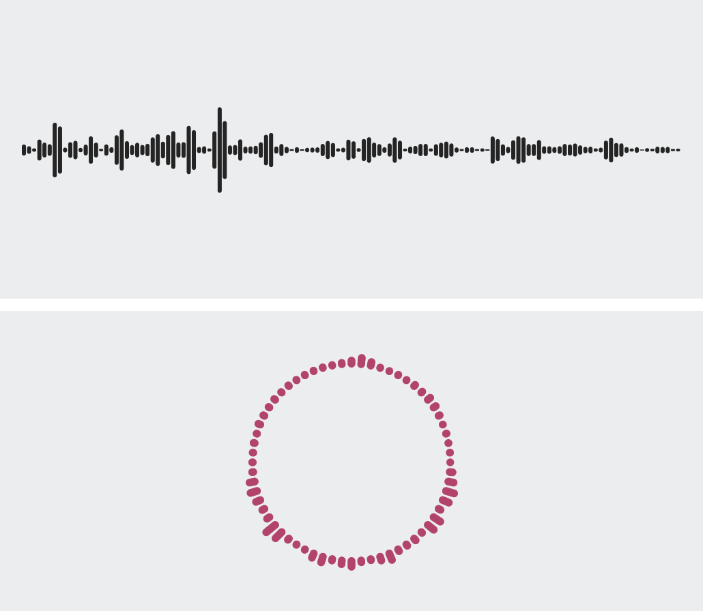

# AudioVisualizerKit

Provides the computational assistance for drawing the audio visualizer.



## Requirements

- Development with Xcode 15.4+
- Written in Swift 5.10
- Compatible with iOS 17.0+, macOS 14.0+

## Privacy Manifest

This library does not collect or track user information, so it does not include a PrivacyInfo.xcprivacy file.

## Installation

AudioVisualizerKit is available through [Swift Package Manager](https://github.com/apple/swift-package-manager/).

**Xcode**

1. File > Add Package Dependencies…
2. Search `https://github.com/Kyome22/AudioVisualizerKit.git`.
3. Add package and link `AudioVisualizerKit` to your application target.

**CLI**

1. Create `Package.swift` that describes dependencies.

   ```swift
   // swift-tools-version: 5.10
   import PackageDescription

   let package = Package(
       name: "SomeProduct",
       products: [
           .library(name: "SomeProduct", targets: ["SomeProduct"])
       ],
       dependencies: [
           .package(url: "https://github.com/Kyome22/AudioVisualizerKit.git", exact: "1.0.0")
       ],
       targets: [
           .target(
               name: "SomeProduct",
               dependencies: [
                   .product(name: "AudioVisualizerKit", package: "AudioVisualizerKit")
               ]
           )
       ]
   )
   ```

2. Run the following command in Terminal.

## Usage
